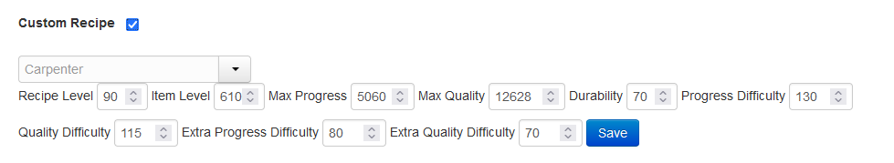

# xiv_csolver
A rust program for solving FFXIV craft recipe. 

Originaly written by [RikaKagurasaka](https://github.com/RikaKagurasaka/xiv_craft_solver),
it now is widely improved and provides python bindings for a GUI (or anything else really)


### Basic RUST CLI Usage
Everything is done through the regular cargo interface
1. Download the latest release.
2. Unzip the file.
3. Edit the `craft.toml` file.
4. Run the program.
5. Wait for about 1-3 seconds.
6. Copy the output.
7. Import to other simulators.

## CLI
When building the CLI invocation is done with the following parameters
```
Small XIV solver library in rust, with python and rust bindings

Usage: xiv_csolver_cli [OPTIONS]

Options:
  -r, --recipe-name <RECIPE_NAME>
          Name of the receipe [default: default_recipe]
  -c, --character-name <CHARACTER_NAME>
          Name of the character [default: default_character]
  -f, --file-name <FILE_NAME>
          The ml file name [default: craft.toml]
  -v, --verbose...
          The verbose flag
  -d, --depth <DEPTH>
          The depth of the first pass [default: 8]
  -t, --threads <THREADS>
          Thread counts, default is 4 [default: 4]
  -D, --desperate
          Desperate mode, will try to finish the craft above all
  -l, --long
          Long mode, will try to find more solutions, at the expense of time
  -h, --help
          Print help
  -V, --version
          Print version
```

## Developpement
Please remember to set and use a venv before building
While not mandatory, using ``cargo-make`` will provide you with the commands:
- cargo make rebuild (rebuilding both the rust and pip bindings)
- cargo make release (rebuilding and bundling the executables (for your os)) in a releases folder

### Rust
Everything is located in the root & src.
You can build the program (CLI) with cargo build the following features are available
``cargo build --features=["fast","no_python","verbose"]``
- The ``no_python`` will not build the lib (WIP, not fully implemented)
- The ``fast`` feature will not allow some under-optimisation to run (saving global run-time)
- The ``verbose`` feature will allow even more debug messages (They might not be shown depending on the verbosity level hoever)

#### Maturin
To build the python module, run either ``maturin develop`` or ``maturin build`` then ``maturin install``

### Python
#### Developping the GUI
0. Activate the venv ``source .venv/bin/activate``
1. Go to the ``python`` directory
2. Install the dev dependencies ``pip install -r requirements_dev.txt``
3. Install the project (in editable mode) ``pip install -e .``
4. Invoke the project (from anywhere) ``python -m xiv_csolver`` 
5. Edit the project and re-invoke it (no need to install / compile again)

#### Rust CLI Example
Note: The recipe data can be retrieved from a [FFXIV Crafting Optimizer](https://yyyy.games/crafter/#/simulator)
with checking of **Custom Recipe** after selecting the recipe.

```toml
[default_recipe]
durability = 70
progress = 5060
quality = 10920
progress_divider = 130
quality_divider = 115
progress_modifier = 80
quality_modifier = 70

[recipe_35]
durability = 35
progress = 3696
quality = 8200
progress_divider = 130
quality_divider = 115
progress_modifier = 80
quality_modifier = 70

[default_character]
craftsmanship = 4041
control = 3959
max_cp = 602
```

#### Output
```
Solving...

 > SOLUTION [Least steps] <
Quality: [10941/10920] | Durability: [0/70] | Cp : [14/602] | Steps : 18
["muscleMemory", "manipulation", "veneration", "wasteNot2", "groundwork", "delicateSynthesis", "basicSynth", "innovation", "preparatoryTouch", "preparatoryTouch", "preparatoryTouch", "preparatoryTouch", "greatStrides", "innovation", "basicTouch", "standardTouch", "greatStrides", "byregotsBlessing", "basicSynth2"]

 > SOLUTION [Most durability] <
Quality: [10923/10920] | Durability: [15/70] | Cp : [4/602] | Steps : 22
["muscleMemory", "manipulation", "veneration", "groundwork", "carefulSynthesis", "prudentTouch", "innovation", "prudentTouch", "prudentTouch", "prudentTouch", "prudentTouch", "manipulation", "innovation", "prudentTouch", "basicTouch", "standardTouch", "advancedTouch", "innovation", "prudentTouch", "basicTouch", "greatStrides", "byregotsBlessing", "basicSynth2"]

 > SOLUTION [Most quality] < 
Quality: [12142/10920] | Durability: [-5/70] | Cp : [1/602] | Steps : 22
["muscleMemory", "manipulation", "veneration", "wasteNot2", "groundwork", "carefulSynthesis", "basicTouch", "innovation", "preparatoryTouch", "basicTouch", "standardTouch", "advancedTouch", "innovation", "prudentTouch", "basicTouch", "standardTouch", "advancedTouch", "innovation", "prudentTouch", "trainedFinesse", "greatStrides", "byregotsBlessing", "basicSynth2"]

Program finished successfully in 954ms
Press enter to exit...
```

You can copy the array part and import to other simulators.

